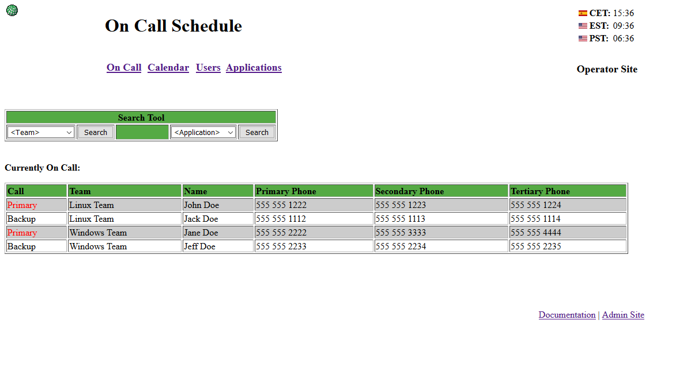
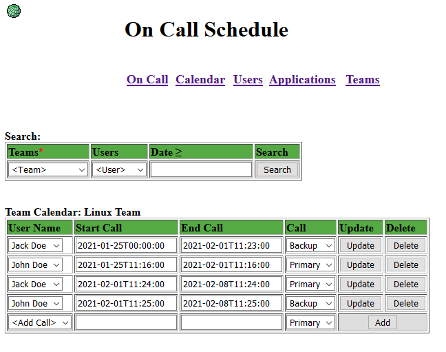
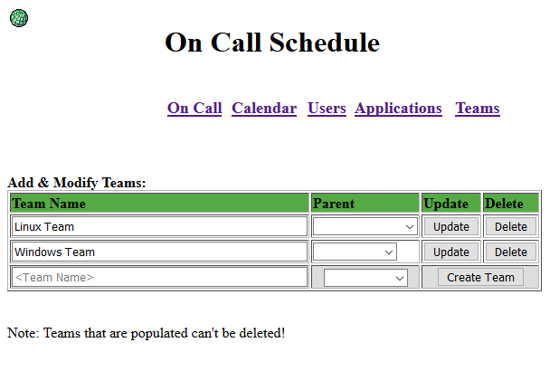
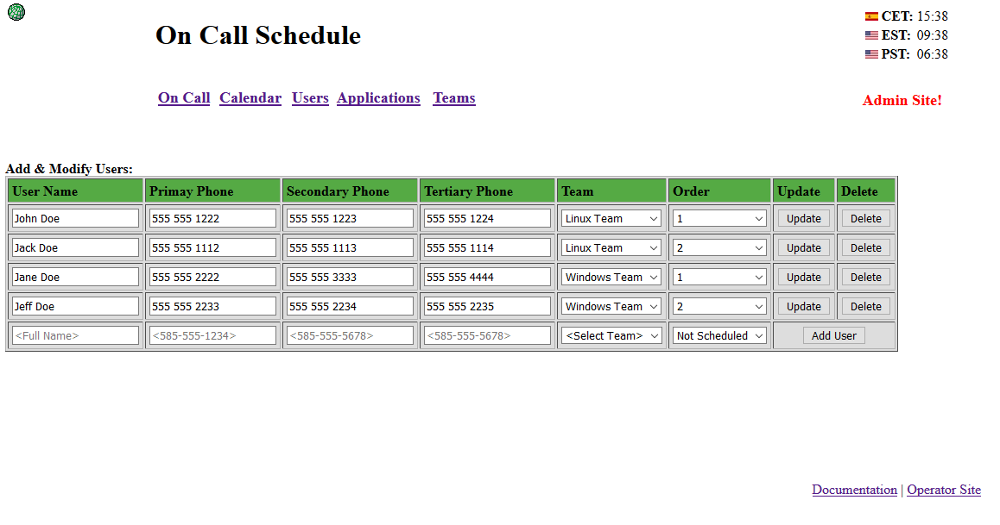
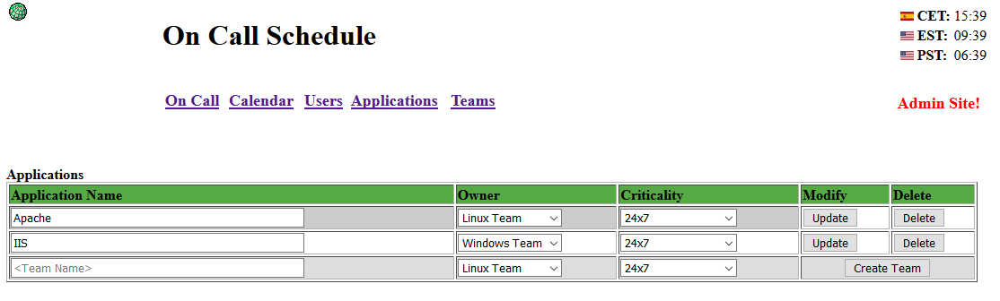

# OnCallTool
A tool for managing On Call Rotation for multiple teams. I wrote this as a replacement for a legacy on call tool that resided on really old hardware. I am a Linux admin and wanted to play with PHP, with some free time I had at that time. Before we were about to implement it, the company decided to not support applications in PHP. So it just sat. It works fairly well and does what is needed. I would not host this on an external facing website as my code is vulernable to SQL injection. I started to fix that, but after the company had no interest in supporting PHP, I stopped development. I used LDAP and a .htaccess file to allow for admin login via AD. Example .htaccess included in the admin/ folder.

# Requirements:
Software: MariaDB/MySQL, Apache HTTPD Server, & PHP

OS: Developed on Red Hat Linux 7, not tested with another OS

# Instructions
1) Setup a Linux Server, such as CentOS 7.
2) yum -y install httpd httpd-tools mod_ldap php-common php-ldap php-pdo php php-mysqlnd php-cli
3) Copy files to /var/www/html/ or use the git command to obtain them.
4) Copy the oncall-admin.conf in httpd/conf.d to /etc/httpd/conf.d
5) Modify the .htaccess file in the admin/ folder for LDAP or google a different solution, if not using LDAP/AD.
6) Create a mysql user like call4help, create a database called oncall, and give call4help permissions to oncall.
7) Important the Database structure: i.e. mysql -u call4help -p oncall < structure.sql (note bug  #2)
8) Start and enable the httpd and mysql services.
9) Copy in your own company logo.png into images/
10) doc.txt includes a little bit of instructions on how to use the tool.

Note: This is all off the cuff and I haven't validated these instructions, please let me know if there is a problem and I will modify the instructions.

# Known Bugs
1) SQL Injection vulernability, do not host on an external site or you can potentially lose information. Started to patch this.
2) Empty Database. There is a bug where it prevents you from adding users and groups properly, if there are none. I never tested this tool from an empty DB, until I decided to post it to gitHub and I purged the DB. The work around is to leave the example users and groups in place, then add a couple of new users and teams. After you add those new users and teams, you can remove the examples. 
3) Some parts of the tool can't have more than one line modified at a time. If you modify more than one line, you risk losing changes from the other lines you changed.

# Examples

On Call Operator View (everyone):

Calendar Configuration (admin):

Teams Setup (admin):

User Setup (admin):

Optional Application/Item Relationships (admin):

